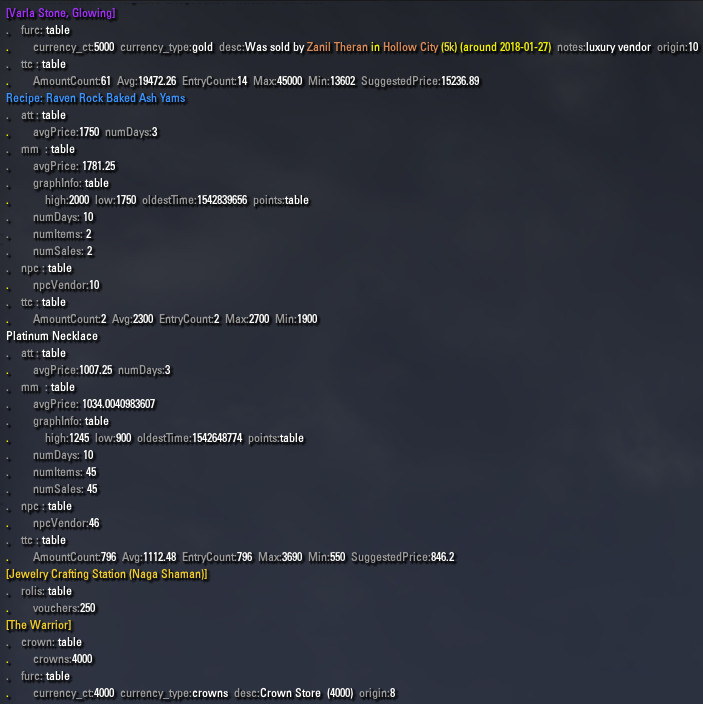

# LibPrice

A library for gathering an item's cost from various add-ons:

- [Master Merchant](https://www.esoui.com/downloads/info928-MasterMerchant.html), by Philgo68
- [Arkadius' Trade Tools](https://www.esoui.com/downloads/info1752-ArkadiusTradeTools.html), by Arkadius, Verbalinkontinenz
- [Tamriel Trade Centre](https://www.esoui.com/downloads/info1245-TamrielTradeCentre.html), by cyxui
- [Furniture Catalogue](https://www.esoui.com/downloads/info1617-FurnitureCatalogue.html), by manavortex

As well as some hard-coded data from

- The Crown Store
- Rolis Hlaalu, the Mastercraft Mediator
- Faustina Curio, the Achievement Mediator

## GitHub Repo

https://github.com/ziggr/ESO-LibPrice

## Example Code

```lua
function LibPrice_Example.SlashCommand()
    local self = LibPrice_Example

    for _,item_link in ipairs(EXAMPLE_ITEMS) do
                        -- Just tell me how much this thing costs.
        local gold   = LibPrice.ItemLinkToPriceGold(item_link)

                        -- Okay, I changed my mind. Tell me a little more:
                        -- where'd you get  this price from?
                        -- (additional return values from same API)
        gold, source_key, field_name
                     = LibPrice.ItemLinkToPriceGold(item_link)
        local header = self.FormatHeader(item_link, gold, source_key, field_name)
        d(header)

                        -- Give me all the data you can find, I'll figure out
                        -- what to do with it later.
        local result = LibPrice.ItemLinkToPriceData(item_link)
        LibPrice_Example.DumpTable(result)
    end
end
```



